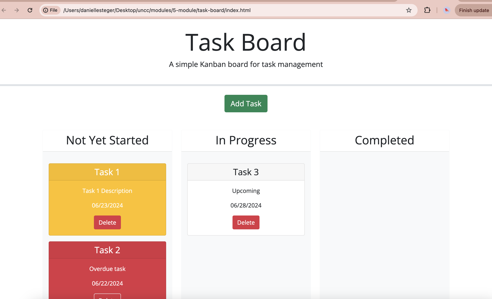
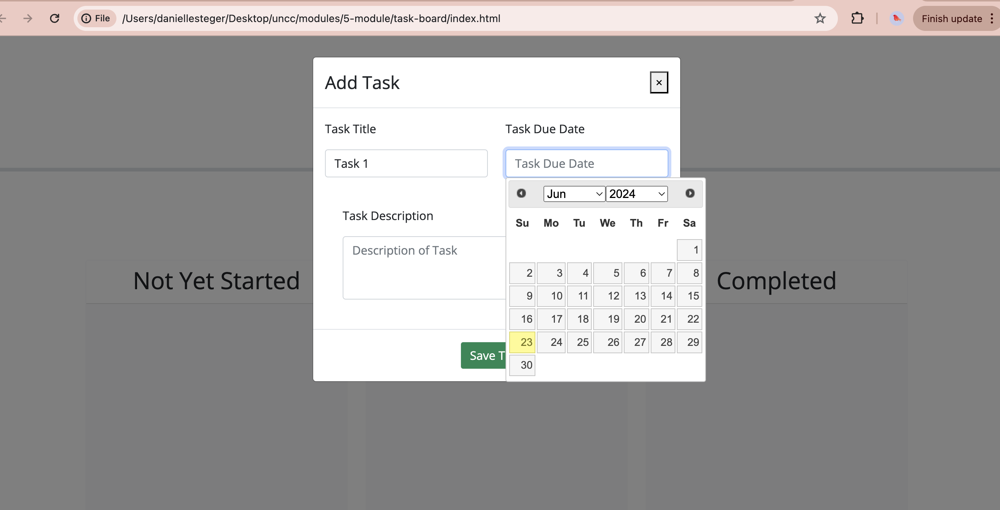
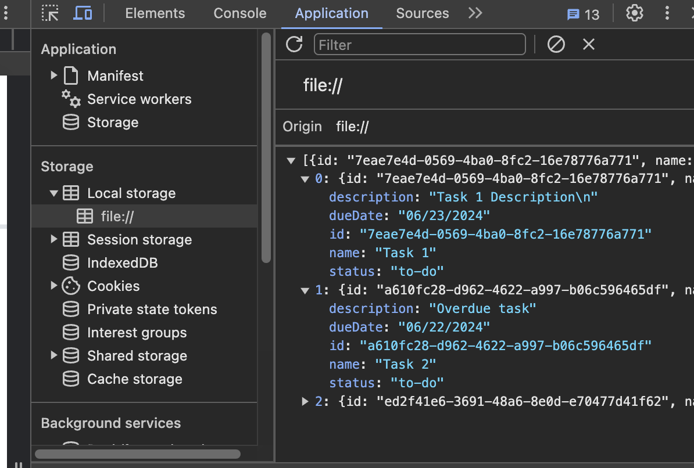

# task-board

## Description

This project involved taking initial code and adding several features to a page using JavaScript, jQuery and Bootstrap. Through this challenge, I was able to continue to practice with previous languages and practice using jQuery and Bootstrap to help make some things more simplified.
You can view this webpage by clicking [here](https://danimsteger.github.io/task-board/).



## Installation

To access the live project, you can visit this [link](https://danimsteger.github.io/task-board/).

To view the code of this project, you can clone this repository using the following commands in your command line:

### Clone this repository

```
git clone git@github.com:danimsteger/task-board.git
```

### Go into this repository

```
cd task-board/
```

### Access code of the repository

```
code .
```

## Usage

To use this page, you can add an upcoming task by clicking the green, ‘Add Task’ button. This will open up a form in a modal. From there, you are able to input the tasks title, description and date from a calendar. Once you hit ‘Save Task’ Button, the form is submitted and the modal goes away. The information from the form is stored locally and populates as a task card on the page.



If the task is past due the card will be red. If today is the due date, it will be yellow. If the due date is not approaching soon, the task card will be white.
Once a task has been started, you can drag and drop the task card into the ‘In Progress’ section and when it is completed, you can drag and drop it into the ‘Done’ section. If the task is no longer relevant, you can also delete it by pressing the “delete” button. this will also delete the task form local storage.


To view an array of the displayed tasks, right-click on the page and choose 'Inspect' from the drop-down menu. A new window will open on the right side of the screen and from their you can view the array, and two messages. If on a Firefox browser, the pane will open at the bottom of your screen, instead of on the right side.



## Credits

The initial code for this project was provided by edX Boot Camps LLC and can be found at this [link](https://git.bootcampcontent.com/UNC-Charlotte/UNCC-VIRT-FSF-FT-06-2024-U-LOLC/-/tree/main/05-Third-Party-APIs/02-Challenge?ref_type=heads). To complete this project, I referenced several articles on "MDN Web Docs" and "W3Schools." Additionally, I referenced materials provided by edX Boot Camps LLC.
Specifically, I used information about bootstrap on MDN for creating a pop-up modal which can be found [here](https://www.w3schools.com/bootstrap/bootstrap_modal.asp).

## License

Distributed under the MIT License. See [LICENSE](LICENSE).
